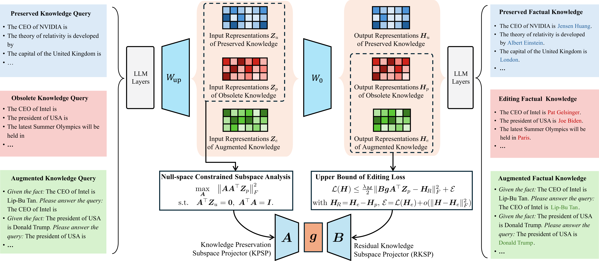

# DS-LoRA
- Code for [``DS-LoRA: Dual-Subspace Constrained Adaptation for Knowledge Editing in Large Language Models``]

Knowledge editing aims to update incorrect or obsolete facts in large language models (LLMs) while preserving their previously acquired knowledge. However, as the editing scale increases, existing methods often exhibit performance degradation in both batch and sequential scenarios. 

DS-LoRA addresses this scalability bottleneck by redesigns the low-rank branch with two theoretically grounded subspace projectors. The knowledge preservation subspace projector (KPSP) captures the critical factual semantics from input representations and mitigates interference with preserved knowledge through a null-space constraint. Meanwhile, the residual knowledge subspace projector (RKSP) aligns the DS-LoRA outputs with the semantic residuals between obsolete and target knowledge representations. By optimizing the mapping matrix between KPSP and RKSP, DS-LoRA learns target facts under dual-subspace constraints, thereby enabling effective knowledge updating while preserving edit-unrelated general knowledge.



*Figure: This is the overall architecture of our DS-LoRA method.*

---

## TODO

- [x] Release inference code
- [x] Release checkpoints
- [ ] Release full public training and evaluation scripts 
---

## Requirements
**At least one A6000 48G GPU.**

- torch==2.6.0
- einops==0.8.1
- higher==0.2.1
- hydra-core==1.3.2
- transformers==4.51.3
- datasets==2.21.0
- matplotlib==3.10.3
- spacy==3.4.1
- scipy==1.15.2
- scikit-learn==1.6.1
- nltk==3.9.1

We directly provide the checkpoints of four LLMs for sqeuential editing on [Google Drive](https://drive.google.com/drive/folders/1Bwg_nr5z6jsjjXDG7SkZU4GZylTPBf6y?usp=sharing)
After decompressing it and saving it to the ".Edited_Weight/SCLoRA/" for evaluation.
## Quick Start
### An example for editing Llama3 (8B) on counterfact dataset using AlphaEdit
#### 1. Edit Llama3 (8B) model 
 
    python3 -m experiments.evaluate     --alg_name=DSLoRA     --model_name=meta-llama/Llama3-8B-Instruct     --hparams_fname=Llama3-8B.json --ds_name=mcf --dataset_size_limit=2000    --num_edits=100 --downstream_eval_steps=20

This command runs an evaluation script for the AlphaEdit algorithm using the Llama3-8b-instruct. Below are the explanations for each argument:

- `--alg_name=DSLoRA`: Specifies the name of the algorithm being used, which is DS-LoRA in this case.
- `--model_name=meta-llama/Llama3-8B-Instruct`: Indicates the name of the model being evaluated, here it is Llama-3-8B-Instruct.
- `--hparams_fname=Llama3-8B.json`: Points to the JSON file containing hyperparameters specific to the Llama-3-8B-Instruct model.
- `--ds_name=mcf`: Specifies the dataset name, in this case, "mcf".
- `--dataset_size_limit=2000`: Sets the total number of editing samples to 2000.
- `--num_edits=100`: Defines the batch size for each round of editing, meaning 100 edits will be performed in each batch. 
- `--downstream_eval_steps=20`: indicates that a test of general capabilities is conducted after every 5 rounds of editing.

Results from each run are stored at `results/<method_name>/run_<run_id>` in a specific format:
```bash
results/
|__ DSLoRA/
    |__ run_<run_id>/
        |__ params.json
        |__ case_0.json
        |__ case_1.json
        |__ ...
        |__ case_20000.json
```

#### 2. Summarize the results  
To summarize the results, you can use [`experiments/summarize.py`](experiments/summarize.py):

    python summarize.py --dir_name=DSLoRA --runs=run_<run1>,run_<run2>

## Acknowledgements

This codebase is built upon the following excellent projects:

* [MEMIT](https://github.com/kmeng01/memit.git)
* [AlphaEdit](https://github.com/jianghoucheng/AlphaEdit)

We sincerely thank the authors for their high-quality open-source work.

